### afterglow

---
### argonaut

---
### ayu-dark
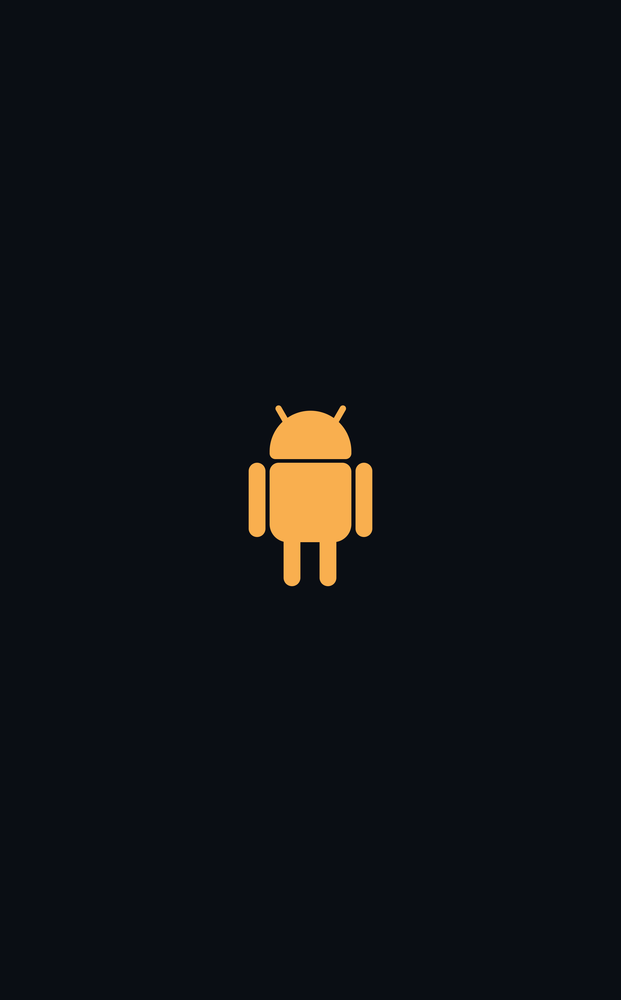

---
### ayu-mirage

---
### base16-default-dark

---
### blood-moon
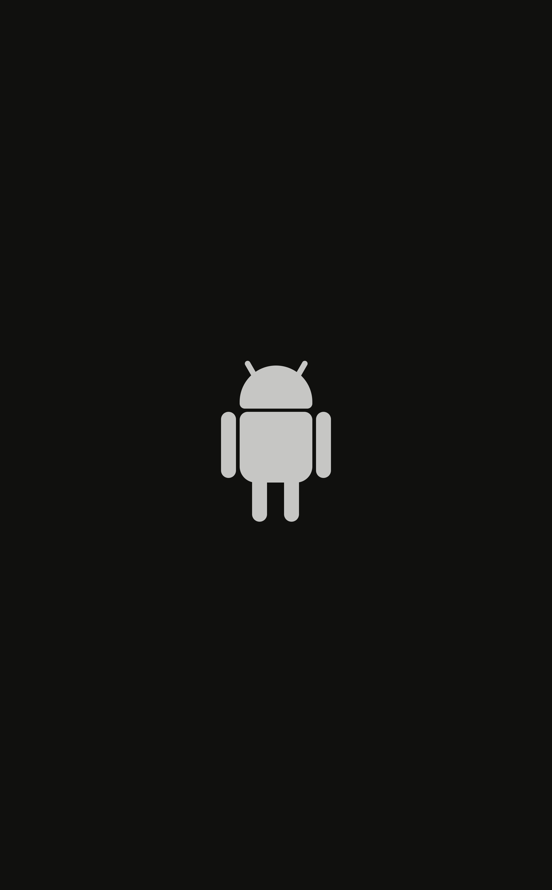

---
### bluescreen
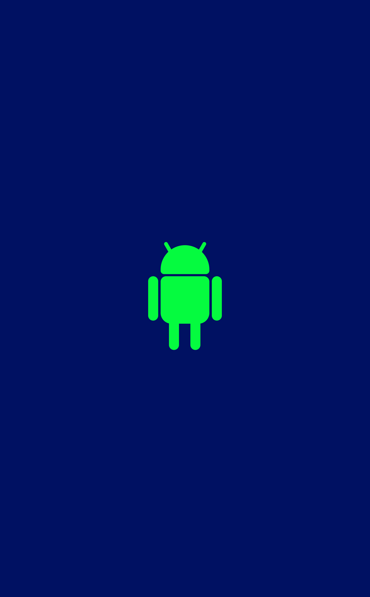

---
### breeze

---
### campbell

---
### cobalt-2

---
### dark-grey
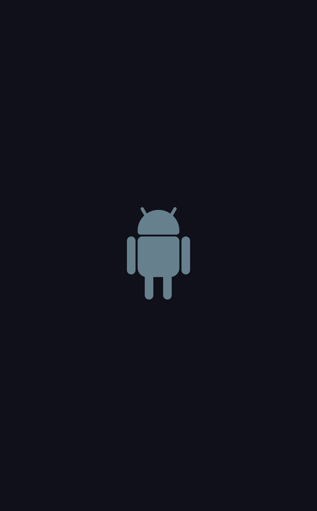

### darkside
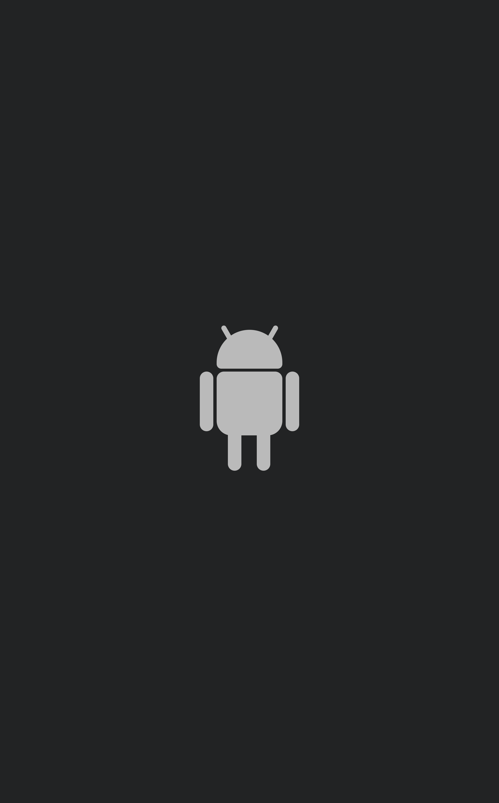

---
### darktooth
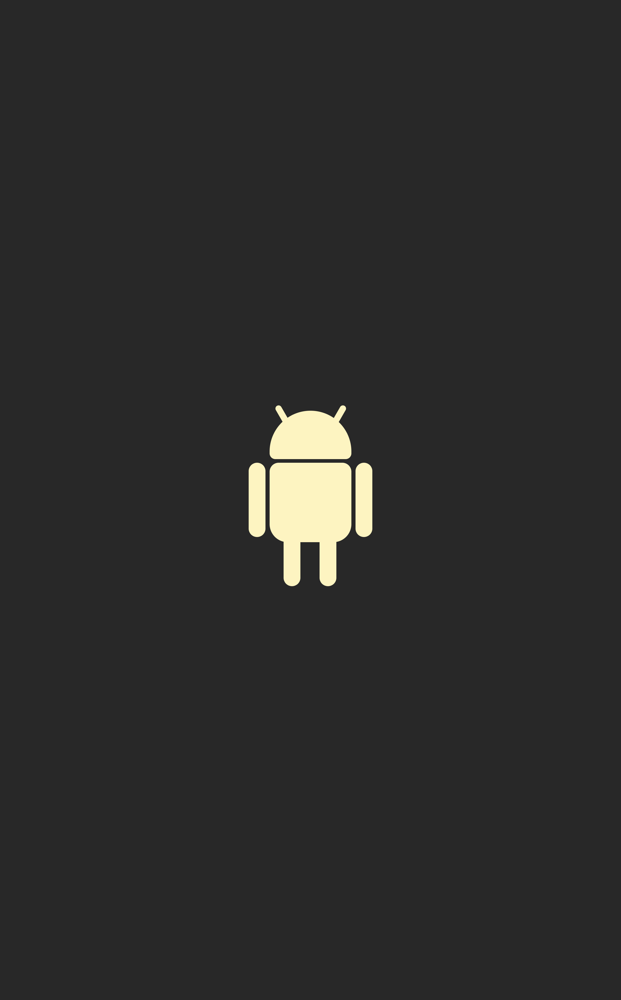

---
### dracula

---
### gnome-dark

---
### greenscreen
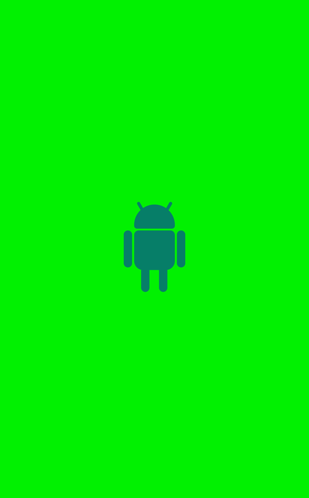

---
### gruvbox-dark

---
### gruvbox-light

---
### hybrid
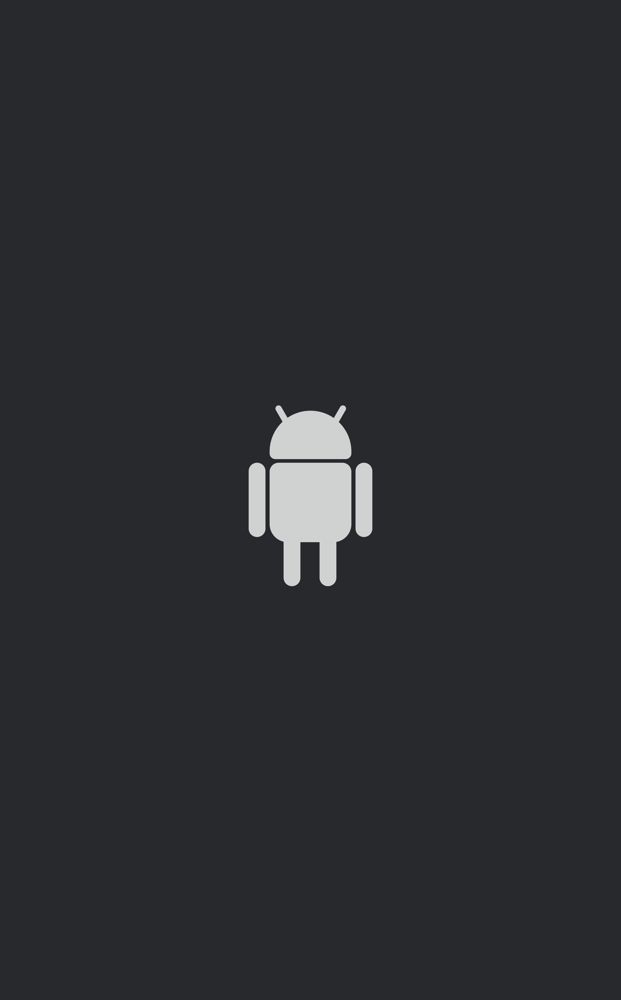

---
### hyber

---
### iceberg-dark
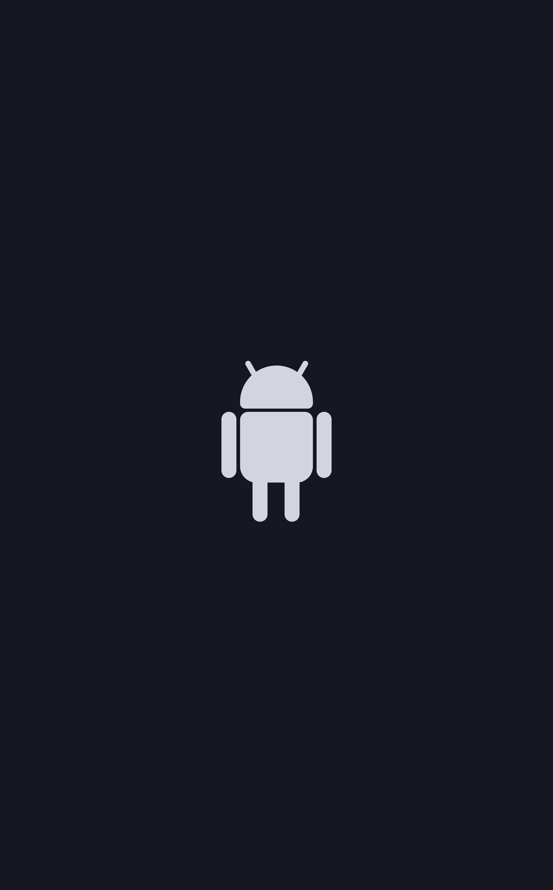

---
### iceberg-light

---
### ir-black

---
### iterm-default
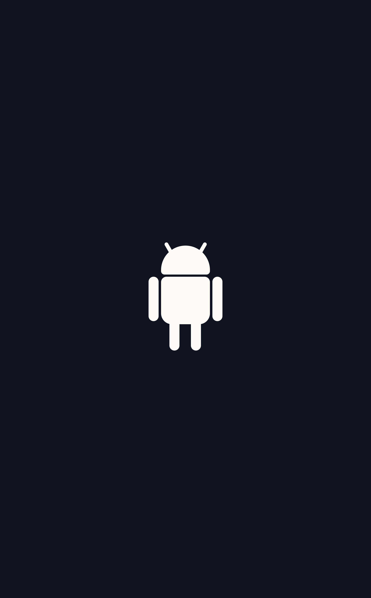

---
### jellybeans
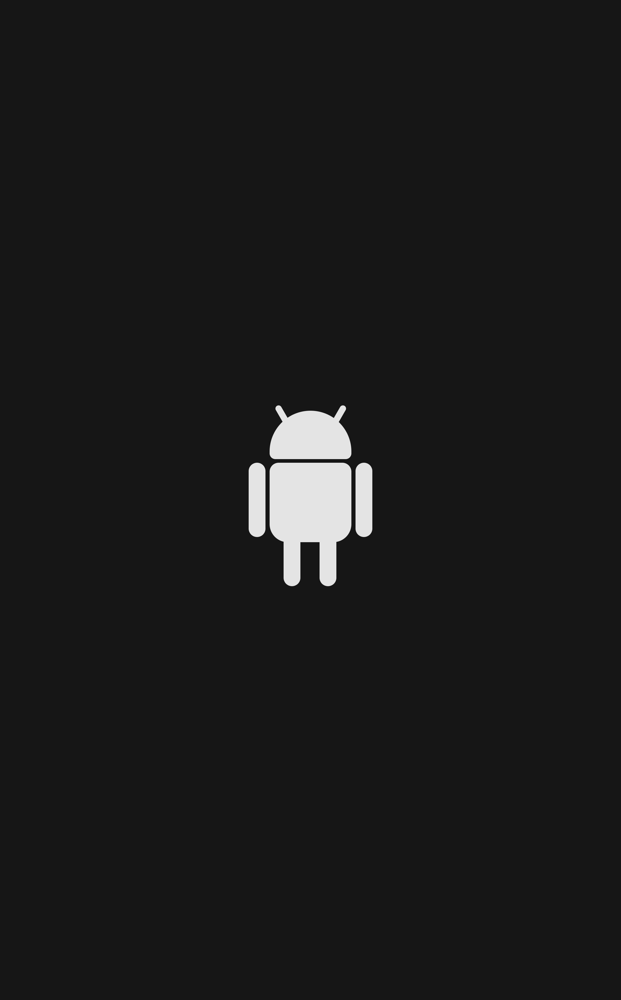

---
### kitty

---
### material-darker
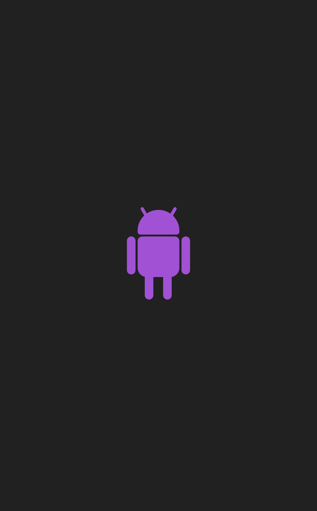

---
### material-ocean
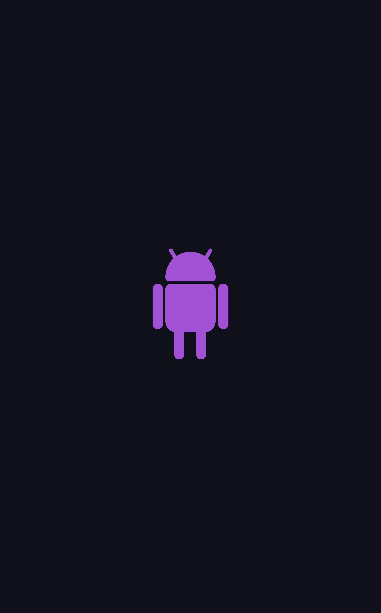

---
### monokay

---
### nord
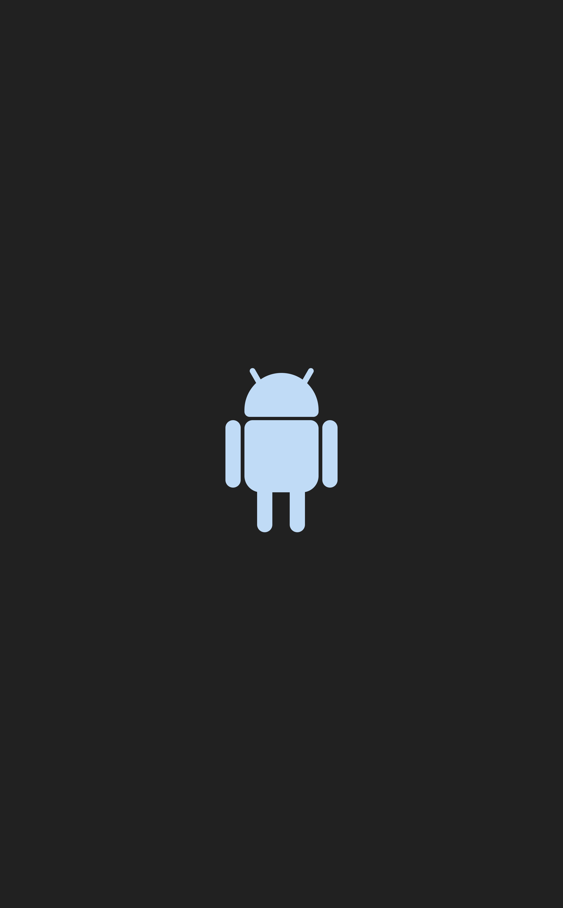

---
### nord-wave

---
### onedark
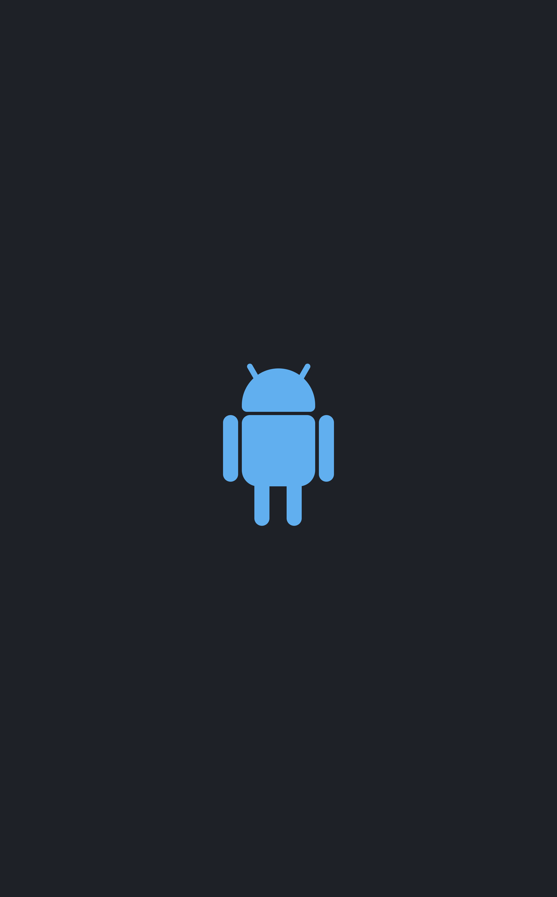

---
### rosepine
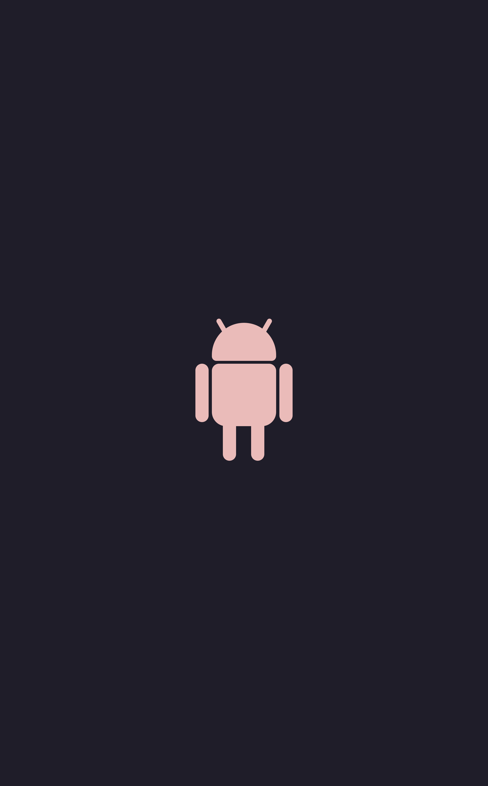

---
### greeny
